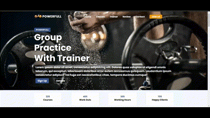
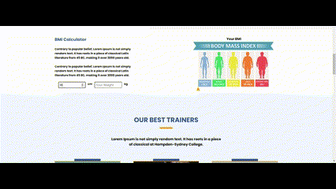

# Sport Center Project

 
This project is a dynamic website aimed at promoting fitness and providing information about various fitness activities and classes. Users can explore different categories such as yoga, group workouts, solo exercises, and stretching routines. The website also includes a BMI calculator to help users monitor their fitness progress.

## Description
**The Sport Center** Website Project is designed to provide users with an interactive platform where they can explore different fitness activities, learn about upcoming classes, and calculate their BMI. It aims to promote a healthy lifestyle by offering valuable information and resources related to fitness and well-being.

## Features

* **Scrolling Navigation Bar:** The navigation bar changes its background color as the user scrolls through the website, providing a visually appealing experience.

* **Dynamic Content Display:** Users can select different categories, such as yoga, group workouts, solo exercises, and stretching routines, to view relevant content dynamically.

* **BMI Calculator:** The website includes a BMI calculator that allows users to input their height and weight to calculate their Body Mass Index, helping them track their fitness progress.

* **Mobile-Friendly Navigation:** The navigation bar is optimized for mobile devices, ensuring a seamless user experience across different screen sizes.

## Usage

* Explore different categories by clicking on the corresponding buttons in the navigation bar.

* Use the BMI calculator to track your fitness progress by entering your height and weight.

* Enjoy a user-friendly and informative experience designed to promote a healthy lifestyle.